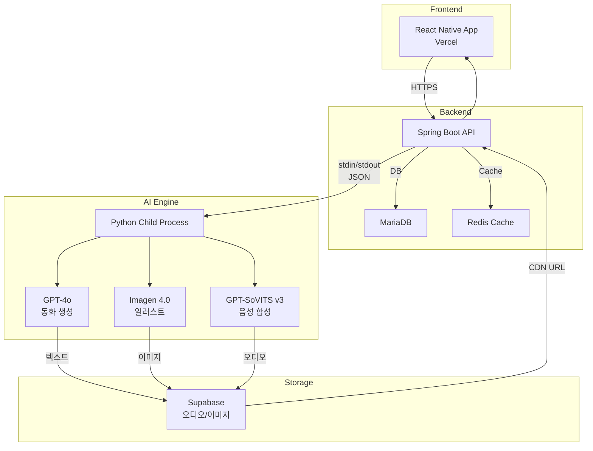

#  옛날옛적에 (Once Upon a Time)
### AI가 들려주는 나만의 동화

<p align="center">
  
  
  
  
  
  
</p>

<p align="center">
  <strong>가천대학교 P-실무 프로젝트 | Team 8 - 옛날옛적팀</strong>
</p>

---

## 🎯 프로젝트 소개

**옛날옛적에**는 AI 기술을 활용하여 3~9세 아동에게 **한국 전통 문화가 담긴 맞춤형 동화**를 실시간으로 생성하고, **12가지 캐릭터 음성**으로 들려주는 오디오북 서비스입니다.

> *"AI 기술로 무한한 이야기를 만들고, 한국의 정서를 담은 목소리로 아이들의 꿈을 키워주는 서비스"*

### 🌟 4가지 차별화 포인트

| 특징 | 설명 |
|------|------|
| 🎨 **진정한 맞춤화** | 템플릿이 아닌 GPT-4o 기반 **실시간 AI 생성**으로 무한한 콘텐츠 확장성 |
| 🎭 **캐릭터 보이스** | 단조로운 TTS가 아닌 **12가지 캐릭터 음성**으로 스토리 몰입 극대화 |
| 🇰🇷 **한국 문화 정체성** | 서양 중심이 아닌 **한국 전통 문화와 정서**를 담은 동화 (한복, 떡, 전통 놀이 등) |
| 👶 **아동 친화적 UX** | 3~9세 아이 스스로 조작 가능한 **직관적 인터페이스** (파스텔 톤, 큰 버튼, 둥근 서체) |

---

## 🔍 개발 배경

### 왜 이 서비스가 필요한가?

#### 1. 저출산 사회의 육아 부담
- **대한민국 합계출산율 0.748명** (2024년, OECD 최하위)
- 부모의 시간 부족과 육아 피로도 증가
- 양질의 육아 시간 확보 어려움

#### 2. 콘텐츠 시장의 서구화
- 국내 아동 콘텐츠 시장의 **90% 이상이 디즈니 등 서구 콘텐츠**
- 한국 문화 정체성을 담은 콘텐츠 부족

#### 3. 시장의 성장 가능성
- 글로벌 TTS 시장: **연평균 30.2% 성장**
- 국내 오디오 콘텐츠 시장: **1,115억 원** (2024년, 4배 이상 성장)
- AI 교육 시장: **연평균 31.2% 성장**

---

## ✨ 핵심 기능

### 1. 🤖 실시간 AI 동화 생성

**GPT-4o 기반 멀티에이전트 파이프라인**으로 고품질 한국 동화를 자동 생성합니다.


#### 품질 평가 루브릭 (100점 만점)

| 평가 항목 | 배점 | 세부 기준 |
|---------|------|----------|
| **한국 문화 반영** | 30점 | 의복, 음식, 명절, 전통 가치관 통합도 |
| **교훈 및 교육성** | 25점 | 효, 우정, 정직 등 도덕적 메시지 명확성 |
| **연령 적합성** | 25점 | 3~9세 언어 수준, 폭력성/공포 배제 |
| **스토리 완성도** | 20점 | 기승전결 구조, 캐릭터 일관성 |

#### 핵심 특징
- ✅ **한국 문화 요소 필수 통합**: 조선시대 배경, 한복, 떡, 전통 놀이, 한국적 가치관 (효, 공동체 의식)
- ✅ **3~7세 눈높이 언어**: 해요체, 의성어/의태어 풍부, 짧은 문장
- ✅ **교훈 자연스럽게 통합**: 억지스럽지 않게 스토리에 녹아든 가치관 교육
- ✅ **안전성 보장**: OpenAI Moderation API + 한국어 유해 단어 리스트 이중 검증
- ✅ **저작권 안전**: 기존 유명 동화와 유사성 체크, 독창적인 플롯 보장

### 2. 🎭 12가지 캐릭터 보이스

**GPT-SoVITS v3** 엔진으로 자연스러운 한국어 음성을 합성합니다.

| 남성 캐릭터 | 여성 캐릭터 |
|------------|------------|
| 🧒 명량한 소년 | 👩‍🏫 선생님 |
| 📚 선비 | 📖 사서 |
| 😈 놀부 | 👑 여왕 |
| 🤴 왕 | 👧 소녀 |
| ⚔️ 지휘관 | 👵 할머니 |
| 👨 총각 | 👸 공주 |

#### 음성 데이터
- **AI Hub "문학작품 낭송·낭독 음성 데이터"** 활용
- ✅ **영구 저작권 프리** (공공기관 제공 데이터)
- ✅ **5가지 감정 포함** (기쁨, 슬픔, 화남, 놀람, 평온)
- ✅ **24kHz 고품질 음성**

> 💡 **중간발표 피드백 반영**: 초기 저작권 우려를 AI Hub 공개 데이터셋으로 완벽 해결

### 3. 🖼️ AI 일러스트레이션

**Google Imagen 4.0 Fast**로 동화 표지와 삽화를 자동 생성합니다.

- 🎨 **수채화 스타일**: 부드럽고 따뜻한 전문 일러스트
- 🎨 **한국 전통 미학**: 한복, 전통 건축, 자연 풍경 자연스럽게 통합
- 🎨 **아동 친화적**: 3~7세 대상, 안전하고 편안한 스타일
- 🎨 **텍스트 완전 배제**: 한글, 영어 등 어떤 문자도 포함하지 않음
- 🎨 **몽환적 분위기**: 보케 효과, 마법적 빛, 레이어드 깊이감

### 4. 📱 직관적인 오디오북 플레이어

아이 스스로 쉽게 조작할 수 있는 사용자 경험 제공

- ▶️ **재생/일시정지/재시작/종료**
- ⏩ **10초 앞으로/뒤로 이동** (15초 설정 가능)
- 📊 **진행률 바** (Progress Bar) 터치 이동
- 📚 **재생 이력 자동 저장**
- 🎨 **어린이 친화적 디자인** (핑크퐁 스타일, 파스텔 톤, 큰 버튼)

---

## 🏗️ 시스템 아키텍처



### 아키텍처 핵심 특징

1. **Python Child Process 분리**
   - Spring Boot에서 stdin/stdout JSON 통신으로 AI 모듈 제어
   - AI 로직 독립성 확보 및 서버 환경 제약 극복

2. **Redis Write Buffer**
   - 트래픽 스파이크 대응
   - 오디오 스트리밍 성능 최적화

3. **Supabase Object Storage**
   - 오디오/이미지 파일 분리 저장
   - CDN을 통한 빠른 전송

4. **Vercel Edge Rewrite**
   - 프론트엔드-백엔드 요청 통합
   - HTTPS 포워딩 및 라우팅 최적화

---

## 🔧 기술 스택

### AI Core

| 구성 요소 | 기술 | 역할 |
|----------|------|------|
| **동화 생성** | GPT-4o (LangChain) | 멀티에이전트 파이프라인 기반 스토리 생성 |
| **이미지 생성** | Google Imagen 4.0 Fast | 수채화 스타일 일러스트 자동 생성 |
| **음성 합성** | GPT-SoVITS v3 | 12가지 캐릭터 음성 TTS |
| **학습 데이터** | AI Hub 문학작품 낭송·낭독 음성 | 저작권 프리 공개 데이터셋 |

### Backend

- **Spring Boot**: REST API 서버
- **MariaDB**: 사용자, 동화 메타데이터 저장
- **Redis**: 캐싱 및 스트리밍 버퍼
- **Supabase Storage**: 미디어 파일 저장

### Frontend

- **React Native**: Android/iOS 크로스플랫폼
- **Vercel**: API 라우팅 및 배포

### Infrastructure

- **Gachon University Server**: ceprj.gachon.ac.kr (Ubuntu 24.04, Python 3.10)
- **Shared GPU**: AI 모델 추론 연산

---

## 🛠️ 기술적 도전과 해결

### 1. 서버 환경 제약 극복

**문제**
- 공유 GPU 환경으로 인한 리소스 제한
- 포트 사용 제약 및 패키지 설치 제한

**해결**
- ✅ Python Child Process로 AI 로직 독립 실행
- ✅ stdin/stdout JSON 통신으로 Spring Boot 연동
- ✅ 패키지 버전 고정 (`torch==2.1.2`, `numpy==1.26.2`)

### 2. AI 모델 배포 이슈 해결

| 문제 | 해결 방법 |
|------|----------|
| TensorFlow 임포트 충돌 | 불필요한 TensorFlow 의존성 제거 |
| PyTorch 2.6 호환성 | `torch==2.1.2`로 다운그레이드 |
| BigVGAN Vocoder 경로 | 절대 경로 지정 및 환경 변수 설정 |
| Git LFS 모델 다운로드 | Git LFS 설정 및 수동 다운로드 스크립트 |

### 3. 저작권 문제 완벽 해결

**중간발표 피드백**
> "음성 데이터의 저작권이 명확하지 않습니다."

**해결 과정**
1. AI Hub "문학작품 낭송·낭독 음성 데이터" 발견
2. 공공기관 제공 데이터로 영구 저작권 프리 확인
3. 연구 및 상업적 활용 모두 가능한 라이센스 확보
4. 5가지 감정이 담긴 고품질 샘플 데이터 제작
5. 24kHz 리샘플링으로 모델 호환성 확보

---

## 🏆 프로젝트 성과

### 기술적 성과

- 🎯 **멀티에이전트 시스템**: Safety → Planner → Writer → Critic 4단계 파이프라인
- 🎯 **실시간 개인화**: 템플릿이 아닌 GPT-4o 기반 진정한 맞춤형 콘텐츠
- 🎯 **한국 문화 정체성**: 한국적 배경, 전통, 정서 자동 통합 보장
- 🎯 **품질 검증 시스템**: 루브릭 기반 100점 만점 평가 (70점 이상 합격)
- 🎯 **12개 캐릭터 음성**: 다양한 목소리로 몰입도 극대화

### 교육적 성과

- 📚 3~7세 아동 눈높이에 맞는 언어 (해요체, 의성어/의태어)
- 📚 한국 문화 요소를 통한 문화적 정체성 형성
- 📚 교훈이 자연스럽게 녹아든 가치관 교육

### 사회적 기여

- 🌱 육아 스트레스 완화를 통한 저출산 문제 간접 지원
- 🌱 바쁜 부모에게 질적 육아 시간 확보 기회 제공
- 🌱 디지털 육아 환경에 최적화된 솔루션

---

## 🚀 향후 발전 계획

### 콘텐츠 확장
- 📖 다문화 동화 시리즈 (세계 각국 전통 동화)
- 📖 계절/이벤트 특화 콘텐츠 (명절, 생일, 입학식)
- 📖 연령대별 세분화 (영아용, 유아용, 초등 저학년용)

### 비즈니스 모델
- 💼 구독 서비스 다층화 (프리미엄 음성 팩, 무제한 생성)
- 💼 B2B 시장 진출 (어린이집, 유치원, 병원 소아과)
- 💼 교육 기관 연계 (교사용 수업 자료 생성 도구)

### 추가 기능
- 🎯 개인 오디오북 라이브러리 (즐겨찾기, 재생 이력)
- 🎯 소셜 공유 기능 (카카오톡 링크 공유)
- 🎯 부모 대시보드 (자녀 청취 패턴 분석, 추천 콘텐츠)

---

## 🎯 기대효과

### 사회적 효과
- 👶 육아 부담 경감 (부모 없이도 교육 콘텐츠 접근 가능)
- 👶 저출산 대응 (육아 스트레스 완화)
- 👶 교육 격차 해소 (경제적 여건 무관 양질의 콘텐츠)

### 교육적 효과
- 📚 언어/인지 발달 (풍부한 어휘와 표현)
- 📚 독서 습관 형성 (오디오북을 통한 책 흥미 유발)
- 📚 가치관 형성 (자연스러운 교훈 전달)

### 문화적 효과
- 🎭 한국 문화 정체성 강화
- 🎭 문화 다양성 존중 (향후 다문화 콘텐츠 확장)
- 🎭 전통 문화 보존 (현대적 방식으로 재해석)

### 경제적 효과
- 💰 신규 시장 창출 (에듀테크 × 키즈테크)
- 💰 관련 산업 생태계 활성화
- 💰 고용 창출 (동화 작가, 성우, AI 엔지니어)

---

## 🚀 시작하기

### 필요 환경
- Node.js 18+
- Python 3.10+
- Java 17+
- Redis
- GPU (GPT-SoVITS 실행 시)

### 설치

```bash
# 1. 저장소 클론
git clone https://github.com/your-team/once-upon-a-time.git
cd once-upon-a-time

# 2. Backend 실행
cd backend
./gradlew bootRun

# 3. AI Server 실행
cd ai
pip install -r requirements.txt
python main.py

# 4. Frontend 실행
cd frontend
npm install
npm start
```

### 주요 패키지 버전

```
# Python (AI)
torch==2.1.2
numpy==1.26.2
transformers==4.40.1
langchain
openai
google-generativeai
```

---

## 👥 팀 구성

**Team 8 - 옛날옛적팀** (가천대학교 P-실무 프로젝트)

| 이름 | 역할 | 담당 업무 |
|-----|------|----------|
| **신은지** | AI 개발 리드 | GPT-4o 동화 생성, GPT-SoVITS TTS, 멀티에이전트 시스템 |
| **김승기** | Frontend 개발 | React Native UI/UX |
| **김은서** | Frontend 개발 | React Native UI/UX, API 통신 |
| **조은성** | Backend 개발 | Spring Boot API, DB 설계 |
| **김사라** | Backend 개발 | Spring Boot API, Redis 최적화, Supabase 연동 |

---

## 📄 라이선스

이 프로젝트는 가천대학교 P-실무 과정의 일환으로 개발되었습니다.

- **AI Hub 음성 데이터셋**: [AI Hub 라이선스](https://aihub.or.kr) 준수
- **OpenAI API**: [OpenAI 이용약관](https://openai.com/policies/terms-of-use)
- **Google Imagen**: [Google Cloud 약관](https://cloud.google.com/terms)

---

## 📞 문의

- **GitHub Issues**: [이슈 등록](https://github.com/your-team/once-upon-a-time/issues)
- **Email**: eunji7480@gachon.ac.kr

---

<p align="center">
  <strong>✨ 아이들에게 한국의 이야기를, 부모에게는 시간을 선물합니다 🎁 ✨</strong>
</p>

<p align="center">
  <sub>AI 기술로 무한한 이야기를 만들고,<br/>한국의 정서를 담은 목소리로 아이들의 꿈을 키워주는 서비스</sub>
</p>

---

**개발 기간**: 2024년 2학기 (약 4주)  
**작성일**: 2024년 12월  
**Team 8 - 옛날옛적팀**
